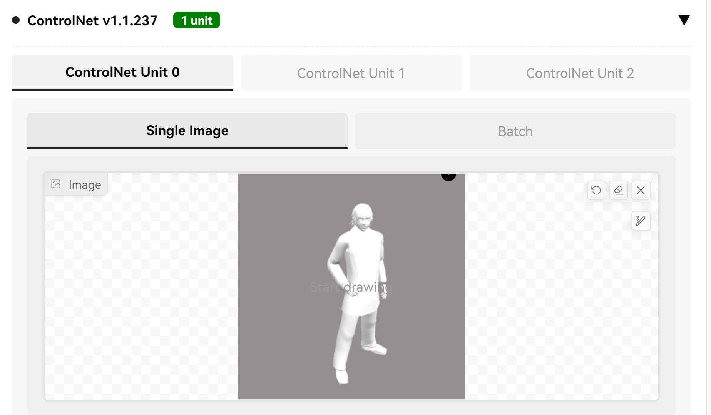
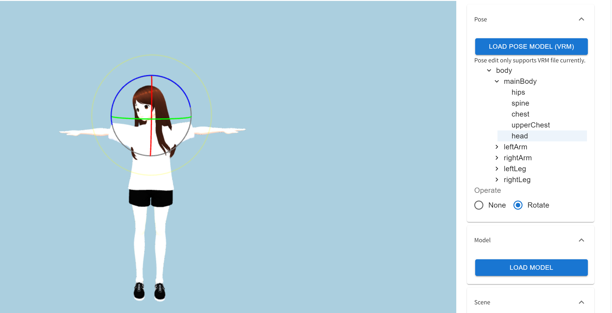
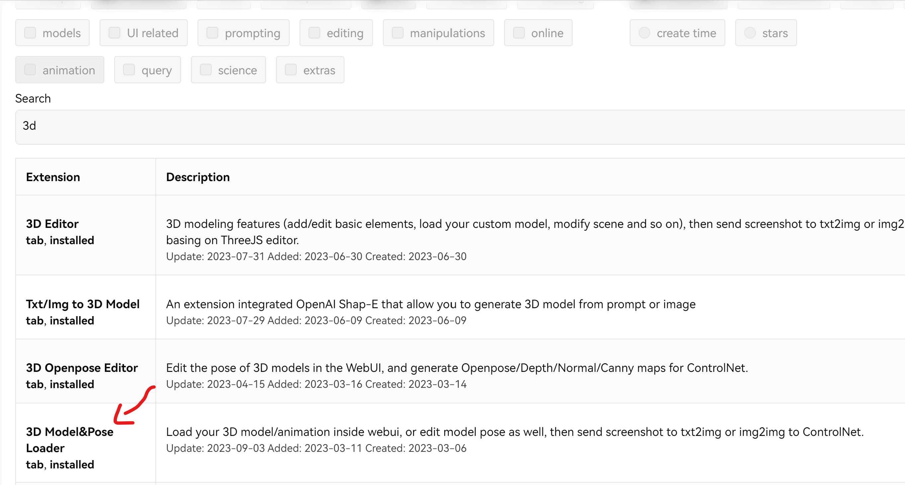
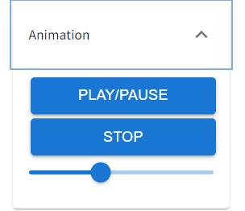

# Stable Diffusion WebUI 3D Model&Pose Loader
A custom extension for [AUTOMATIC1111/stable-diffusion-webui](https://github.com/AUTOMATIC1111/stable-diffusion-webui) that allows you to load your local 3D model/animation inside webui, or edit pose as well, then send screenshot to txt2img or img2img as your ControlNet's reference image.  

## Support formats
Currently, it supports to load several types with two modes.  
**Single File mode**  
By the default, you can upload single file directly, support formats:
1. obj
2. stl
3. dae
4. fbx
5. vrm
6. glb - partly support, it fails on the model needs KTX2 textures (like [coffeemat.glb](https://github.com/mrdoob/three.js/blob/dev/examples/models/gltf/coffeemat.glb)), need to figure out how to fix later
7. gltf - partly support, it fails on the model has other resources (like [DamagedHelmet.gltf](https://github.com/mrdoob/three.js/tree/dev/examples/models/gltf/DamagedHelmet/glTF)), will fix later in Multi Files mode

But it has potential to support more, since threejs does.
So if you want other formats such as cmt, just feel free to open an issue, I will add it later.  
(I upload two models, **male02.obj** and **Sanba Dancing.fbx**, as your test, you can find them under **/models** folder)

## Pose support
you can use Pose Panel to edit pose on VRM format.

## Installation
Just like you install other extension of webui:
1. go to Extensions -> Install from URL
2. paste this repo link
3. install
4. go to Installed, apply and restart UI

Or you can install from Extensions -> Available, and load the official extension link, then you can find this extension on the list.

## Settings
Do not use configurations under Settings -> 3D Model, it would not work.  
I will remove them later.

## Settings from page
There are 4 panels and several buttons on the page:
1. Model - allow you to load your local 3d model file.
2. Scene - control the canvas properties, list the objects in the scene
   1. click **Refresh Scene Tree** if there is nothing
   2. click **Scene** - to show up background color picker  
   
   3. **visible checkbox** is available on _Directional Light_, _Ground_, _Grid_, _Axis_ and _mainObject_, you use it to show objects up or not   
   
   4. **Operate radio button** is available on _Directional Light_, _Hemisphere Light_, and _mainObject_, you use it to translate or rotate object from scene (in fact, I will use this to rebuild pose editor later)   
    
   5. click **Preview Camera** - show up Near, Far and FOV for camera   
   
3. Animation - control the FBX animation playing with progress bar here.   

4. Send To ControlNet - Send the current preview view of the 3D model on ControlNet in txt2img or img2img   

## Operation
On the main tab of 3D Model Loader, you can use:
1. **Mouse left button** -> rotate the camera
2. **Mouse wheel** -> zoom in or out
3. **Mouse right button** -> move the camera

## Gradio.Model3D?
I know gradio has its own 3D model component called **Gradio.Model3D**, but it only supports three formats: obj, glb and gltf, I think it is not enough, at least it should support FBX animation, so I build my own extension.

## Credits
Created by [jtydhr88](https://github.com/jtydhr88) and special thanks to other contributors:
- [missionfloyd](https://github.com/missionfloyd)
- [chucktobbes](https://github.com/chucktobbes)
- Everyone who gives feedback

## My other extension for Stable diffusion webui
- [Canvas Editor](https://github.com/jtydhr88/sd-canvas-editor) A custom extension for AUTOMATIC1111/stable-diffusion-webui that integrated a full capability canvas editor which you can use layer, text, image, elements and so on, then send to ControlNet, basing on Polotno.
- [StableStudio Adapter](https://github.com/jtydhr88/sd-webui-StableStudio) A custom extension for AUTOMATIC1111/stable-diffusion-webui to extend rest APIs to do some local operations, using in StableStudio.
