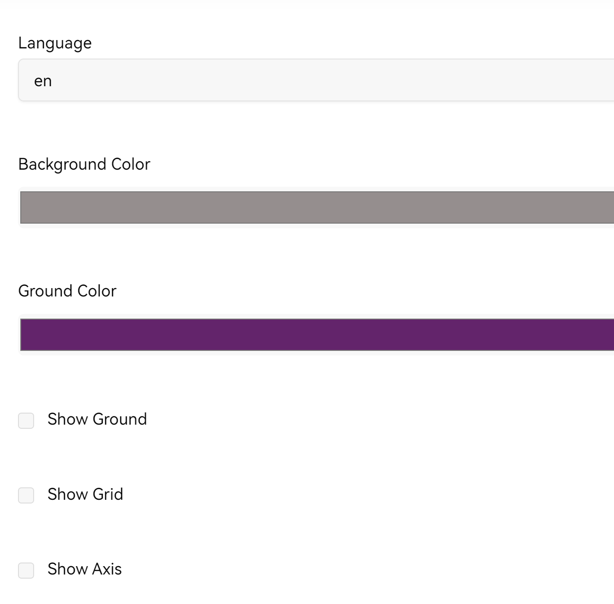
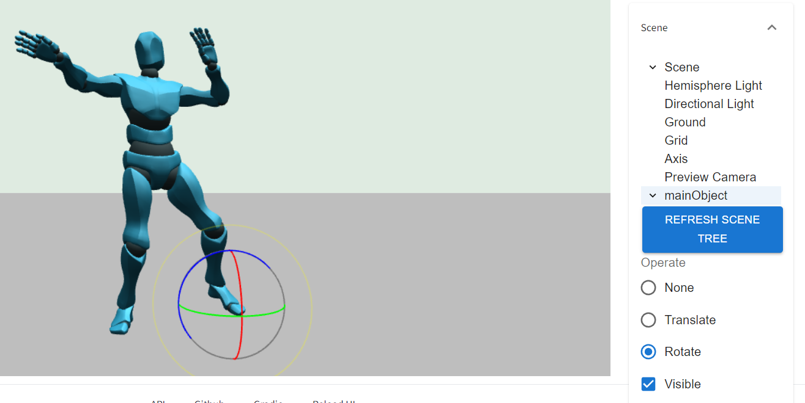

# Settings
You can go to sd webui settings tab, and find **3D Model&Pose** page to set up some default configurations.

1. Language - you choose your prefer display language, currently, this extension supports: 
   1. en (English) 
   2. zh-CN (简体中文) 
   3. zh-TW (繁体中文) 
   4. ja (日本語)
   5. fr (français)
2. Background Color - Choose one color as default background color.
3. Ground Color - Choose one color as default ground color.
4. Show Ground - Decide whether to display the ground by default.
5. Show Grid - Decide whether to display the gril by default.
6. Show Axis - Decide whether to display the axis by default.

Please note, once you make any changes on this page, you must go to **Extensions** and **Apply and restart UI** to apply the changes.
## Settings from page
There are some panels and several buttons on the page:
1. Model - allow you to load your local 3d model file.
2. Scene - control the canvas properties, list the objects in the scene
   1. click **Refresh Scene Tree** if there is nothing
   2. click **Scene** - to show up background color picker  
   
   3. **visible checkbox** is available on _Directional Light_, _Ground_, _Grid_, _Axis_ and _mainObject_, you use it to show objects up or not   
   
   4. **Operate radio button** is available on _Directional Light_, _Hemisphere Light_, and _mainObject_, you use it to translate or rotate object from scene (in fact, I will use this to rebuild pose editor later)   
    
   5. click **Preview Camera** - show up Near, Far and FOV for camera   
   
3. Animation - control the FBX animation playing with progress bar here.   

4. Send To ControlNet - Send the current preview view of the 3D model on ControlNet in txt2img or img2img   
